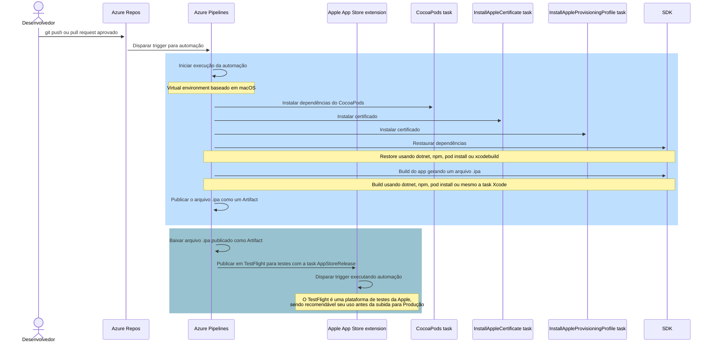

# AzureDevOps-Build-iOS
Materiais de apoio para build de apps iOS no Azure DevOps/Azure Pipelines.

---

## Fluxo básico

```mermaid
sequenceDiagram
    actor Desenvolvedor
    participant Azure Repos
    participant Azure Pipelines
    participant Apple App Store extension
    participant CocoaPods task
    participant InstallAppleCertificate task
    participant InstallAppleProvisioningProfile task
    participant SDK
    Desenvolvedor->>+Azure Repos: git push ou pull request aprovado
    Azure Repos->>+Azure Pipelines: Disparar trigger para automação
    rect rgb(191, 223, 255)
    Azure Pipelines->>+Azure Pipelines: Iniciar execução da automação
    Note over Azure Pipelines,Azure Pipelines: Virtual environment baseado em macOS
    Azure Pipelines->>+CocoaPods task: Instalar dependências do CocoaPods
    Azure Pipelines->>+InstallAppleCertificate task: Instalar certificado
    Azure Pipelines->>+InstallAppleProvisioningProfile task: Instalar certificado
    Azure Pipelines->>+SDK: Restaurar dependências
    Note over Azure Pipelines,SDK: Restore usando dotnet, npm, pod install ou xcodebuild
    Azure Pipelines->>+SDK: Build do app gerando um arquivo .ipa
    Note over Azure Pipelines,SDK: Build usando dotnet, npm, pod install ou mesmo a task Xcode
    Azure Pipelines->>+Azure Pipelines: Publicar o arquivo .ipa como um Artifact
    end
    rect rgb(152, 194, 207)
    Azure Pipelines->>+Azure Pipelines: Baixar arquivo .ipa publicado como Artifact
    Azure Pipelines->>+Apple App Store extension: Publicar em TestFlight para testes com a task AppStoreRelease
    Apple App Store extension->>+Apple App Store extension: Disparar trigger executando automação
    Note over Apple App Store extension,Apple App Store extension: O TestFlight é uma plataforma de testes da Apple,<br/>sendo recomendável seu uso antes da subida para Produção
    end
```
